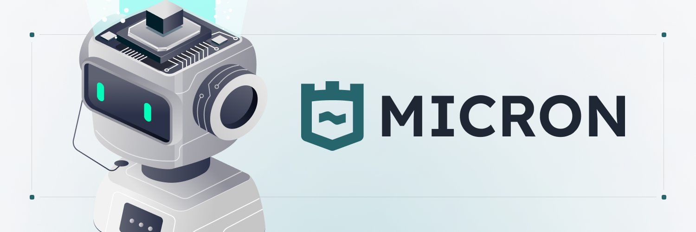
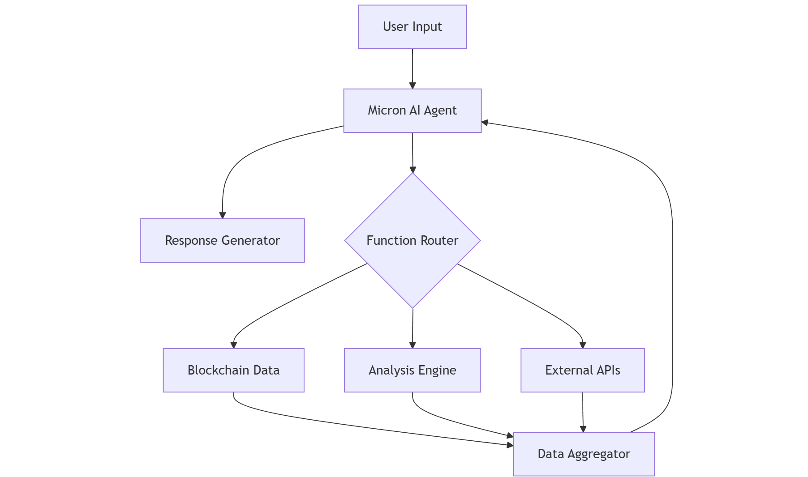

<h1 align="center"> Micron CLI </h1>
<p align="center">
Micron provides an adaptive AI-powered CLI framework for deep DeFi data and risk analytics using real-time on-chain insights. Built on Solana's high-performance blockchain, it combines advanced machine learning models with comprehensive blockchain analytics to provide advanced token analysis, automated risk assessment, and AI agent deployment capabilities.
</p>

<div align="center">

[](https://www.typescriptlang.org/)
[](https://solana.com/)
[](https://openai.com/)
[](https://nodejs.org/)

[](https://github.com/micronsh/micron-cli)
[](https://opensource.org/licenses/MIT)
[](https://github.com/micronsh/micron-cli/graphs/commit-activity)
[](https://github.com/micronsh/micron-cli)

</div>

<p align="center">
  <a target="_blank" href="https://micron.sh">Home</a> | <a target="_blank" href="https://docs.micron.sh">Documentation</a> | <a target="_blank" href="https://docs.micron.sh">Roadmap</a>
</p>

## Table of Contents

- [Table of Contents](#table-of-contents)
- [Why Micron CLI?](#why-micron-cli)
- [Installation](#installation)
  - [Start Micron with Gitpod](#start-micron-with-gitpod)
- [Quick Start](#quick-start)
- [Agent Management](#agent-management)
  - [Creating Custom Agents](#creating-custom-agents)
  - [Deploying Agents](#deploying-agents)
- [API Integration](#api-integration)
  - [Key Endpoints](#key-endpoints)
  - [Example: Token Analysis API Call](#example-token-analysis-api-call)
  - [Example: GET Agents List](#example-get-agents-list)
  - [Response:](#response)
  - [Use Cases](#use-cases)
- [Project Architecture](#project-architecture)
  - [High-level System Flow](#high-level-system-flow)
  - [Component Structure](#component-structure)
  - [Data Flow](#data-flow)
  - [Function Organization](#function-organization)
- [Security](#security)
- [License](#license)

---

## Why Micron CLI?

Micron CLI stands out for its combination of **AI-driven insights** and **blockchain-native capabilities**, offering:  
- **Real-time risk analysis** with detailed breakdowns for developers and investors.  
- **AI-powered contextual insights** for better decision-making.  
- **Easy extensibility and modular design**, built with TypeScript for developers.  
- **Secure, scalable, and fast execution** on the Solana blockchain.  

---

## Installation

Install and configure Micron CLI in a few simple steps:

1. Clone the repository:  
  ```ssh
   git clone https://github.com/micronsh/micron-cli.git  
   cd micron-cli  
  ```
2. Install dependencies:  
  ```ssh
   npm install  
  ```

3. Solana Wallet Setup
```bash
# Generate new keypair
solana-keygen new --outfile ~/.config/solana/micron-wallet.json

# Set default wallet
solana config set --keypair ~/.config/solana/micron-wallet.json

# Verify wallet setup
solana address
solana balance
```
4. Set up environment variables:  
   Configure the following variables in your `.env` file or environment:  
```env
   OPENAI_API_KEY=<your-openai-api-key>  
   SOL_WALLET_KEY=<your-wallet-private-key>  
   API_URL=https://api.micron.sh  
   SOLANA_RPC_URL=https://api.mainnet-beta.solana.com  
```
**Note:** Ensure your `.env` file is not included in version control to protect sensitive information. Use secure storage solutions for environment variables.

---

### Start Micron with Gitpod

[](https://gitpod.io/#https://github.com/micronsh/micron-cli)

## Quick Start

Micron CLI's primary interface is an AI-powered chat mode that connects you with specialized agents for token analysis.

1. Start the CLI:
  ```ssh
   npm run micron
  ```
   This launches the interactive chat mode where you can:
   - Select from available analysis agents
   - Chat naturally about token analysis
   - Get real-time blockchain insights

1. Example Interactions:

   | Question | Agent Response |
   |----------|----------------|
   | "Analyze this token: ABC123..." | Detailed risk assessment and metrics |
   | "Compare it with XYZ789..." | Side-by-side comparison of key indicators |
   | "Show me the largest holders" | Holder distribution analysis |
   | "Is the liquidity healthy?" | Liquidity depth and stability metrics |

2. Direct Analysis Commands:
   
   | Command | Purpose |
   |---------|---------|
   | npm run micron scan <address> | Quick security scan |
   | npm run micron risk <address> | Full risk report |
   | npm run micron holders <address> | Holder analysis |
   | npm run micron compare <addr1> <addr2> | Token comparison |

---
The chat mode is context-aware, meaning agents remember your conversation and can build upon previous analyses for deeper insights.

## Agent Management

### Creating Custom Agents

The `create` command allows you to define custom AI agents locally:

| Command | Description |
|---------|-------------|
| npm run micron create | Interactive agent creation |

During creation, you'll configure:
- Agent ID (unique identifier)
- Name and description
- System prompt (agent's personality/expertise)
- Analysis capabilities
- Initial SOL amount for liquidity

Example creation flow:
```
? Enter agent ID: market-sage
? Enter agent name: Market Sage
? Enter agent description: Expert in market dynamics and trend analysis
? Select capabilities: Token Analysis
? Enter system prompt: You are an expert in analyzing market trends...
```

The agent is saved locally in `data/agents.json` and can be deployed later.

### Deploying Agents

The `deploy` command deploys your agent to the Solana blockchain:

| Command | Description |
|---------|-------------|
| npm run micron deploy | Deploy agent to Solana |

Requirements:
- Solana wallet with sufficient SOL (minimum 0.1 SOL)
- SOL for deployment fees (~0.05 SOL)
- SOL for initial liquidity (configurable)

Deployment process:
1. Creates SPL token for agent access
2. Uploads agent metadata to IPFS
3. Initializes Pump bonding curve
4. Returns deployment details:
   - Transaction signature
   - Mint address
   - Pump.fun trading link

Example deployment output:
```
Deploying agent: Market Sage
Transaction: https://solscan.io/tx/2rLZF...
Mint Address: BKyz7...
Deploy Link: https://pump.fun/coin/BKyz7...
```
---

## API Integration

Micron CLI provides a powerful API for programmatic access to its features.

### Key Endpoints

| Endpoint                     | Method | Description              | Authentication        |
|------------------------------|--------|--------------------------|-----------------------|
| /v1/agents                  | GET    | List available agents.   | No API Key required.     |
| /v1/token/{address}         | GET    | Analyze a token.         | No API Key required.     |

### Example: Token Analysis API Call
```javascript
import fetch from 'node-fetch';

async function analyzeToken(address) {  
  const response = await fetch(`https://api.micron.sh/v1/token/${address}`, {  
  });  
  const data = await response.json();  
  console.log('Token Analysis:', data);  
}  

analyzeToken('<token_address>');  
```
---

### Example: GET Agents List
```javascript
import fetch from 'node-fetch';

async function getAgents() {  
  const response = await fetch(`https://api.micron.sh/v1/agents/}`, {  
  });  
  const data = await response.json();  
  console.log(data);  
}  

getAgents();  
```
### Response:
```json
{
  "data": [
    {
      "id": "degen-hunter",
      "name": "Degen Hunter",
      "description": "High-risk, high-reward token analyzer focused on momentum and quick gains",
      "capabilities": [
        "TOKEN_ANALYSIS"
      ],
      "systemPrompt": "..."
    },
    ...
  ]
}
```    
---

### Use Cases

| Industry | Application | Implementation |
|----------|-------------|----------------|
| DeFi Protocols | Risk assessment | Automated trading gates |
| Trading Platforms | Market analysis | Real-time trading signals |
| Wallet Apps | Token verification | Pre-transaction checks |
| Security Tools | Contract audit | Continuous monitoring |

## Project Architecture

### High-level System Flow



The Micron CLI architecture consists of four main layers working together to provide comprehensive token analysis:

1. User Interface Layer
   - CLI interface for commands and natural language chat
   - Command parsing and routing

2. Agent Layer (Micron AI Agent)
   - GPT-4 integration with function calling
   - Context and conversation management

3. Processing Layer (Function Router)
   - Blockchain data collection
   - Analysis engine computations
   - External API integrations

4. Data Layer (Data Aggregator)
   - Data consolidation and processing
   - Response formatting and delivery

This architecture enables seamless interaction between user inputs, AI processing, and blockchain data analysis, providing real-time insights through natural language interaction.

### Component Structure

`Commands/`
- Implements individual CLI commands
- Each command is a separate class
- Handles user input validation
- Delegates to services for core logic

`Services/`
- `api.service`: Handles API communication
- `storage.service`: Manages local data persistence
- `agent.service`: Handles agent lifecycle

`Types/`
- Defines interfaces for data structures
- Ensures type safety across components
- Documents data contracts

### Data Flow

1. Command Execution:
   `Input` → `Validation` → `Service Call` → `Output Formatting`

2. Agent Deployment:
   `Create Agent` → `Upload Metadata` → `Deploy Token` → `Initialize Liquidity`

3. Analysis Flow:
   `Fetch Data` → `Process Indicators` → `Generate Report` → `Format Output`

### Function Organization

| Layer | Responsibility | Example |
|-------|---------------|---------|
| Commands | User interaction | `execute()`, `prompt()` |
| Services | Business logic | `analyzeToken()`, `deployAgent()` |
| Utils | Shared functionality | `formatAmount()`, `validateAddress()` |
| Types | Type definitions | `interface TokenData`, `type AgentConfig` |


## Security

We take security very seriously. If you come across any security vulnerabilities, please disclose them by sending an email to security@micron.sh. We appreciate your help in making our platform as secure as possible and are committed to working with you to resolve any issues quickly and efficiently. See [`SECURITY.md`](./SECURITY.md) for more information.


---

## License

This project is licensed under the MIT License. See the LICENSE file for details.

---